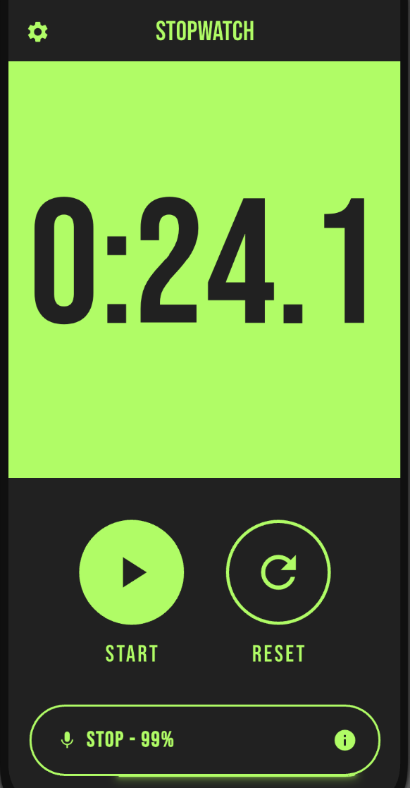

# Voice-Activated Timer App

A Flutter-based voice-controlled timer app designed for hands-free use during calisthenics exercises.

## Screenshot



## Features

- **Voice Commands**: Start and stop timer with voice commands ("start", "stop" and variations)
- **SS.S Time Format**: Displays time as total seconds with one decimal place (e.g., "72.3" for 1:12.3)
- **Audio Feedback**: Beep sound confirmation when voice commands are recognized
- **Dark Theme**: Material 3 dark theme with iOS-style circular control buttons
- **Responsive Design**: Adaptive layout that works across different screen sizes
- **Comprehensive Permissions**: Proper microphone permission handling with graceful fallback

## Requirements

- Flutter SDK 3.0+
- iOS 10.0+ / Android API 21+
- Microphone permissions for voice recognition

## Installation

1. Clone the repository
2. Install dependencies:
   ```bash
   flutter pub get
   ```
3. Run the app:
   ```bash
   flutter run
   ```

## Development Commands

- `flutter run` - Run in development mode
- `flutter test` - Run all tests
- `flutter analyze` - Run static analysis
- `flutter build apk` - Build Android APK
- `flutter build ios` - Build iOS app

## Architecture

- **TimerPage**: Main screen managing stopwatch state and voice integration
- **TimerDisplay**: 60fps timer display with precise SS.S formatting
- **ControlButtons**: iOS-style circular Start/Stop/Reset buttons
- **SpeechService**: Voice recognition with continuous listening
- **AudioService**: Audio feedback with fallback mechanisms
- **PermissionService**: Microphone permission management

## Dependencies

- `speech_to_text: ^7.0.0` - Voice recognition
- `permission_handler: ^11.3.1` - Runtime permissions
- `audioplayers: ^6.1.0` - Audio feedback

## Usage

1. Grant microphone permissions when prompted
2. Use voice commands "start" or "stop" to control the timer
3. Use physical buttons as backup controls
4. Timer displays in SS.S format for easy reading during exercises
